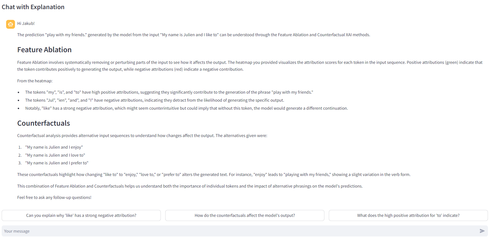

# TELL-ME

Toward personalized Explanations of Large Language ModEls. 

A prototype for personalized explanations of generative artificial intelligence (GenXAI) outputs. This README provides an overview of the project, installation instructions and other essential information.




## Project Overview

The prototype is designed to facilitate easy interaction with personalized GenAI output explanations. The interface allows users to input text, let a model make a prediction, and get personalized explanations for the prediction. The personalization refers to the users name and knowledge level of XAI in general. 

The prototype currently supports two types of GenAI model inference:
- Sentiment Analysis
    - Model: `distilbert/distilbert-base-uncased-finetuned-sst-2-english` ([Source](https://huggingface.co/distilbert/distilbert-base-uncased-finetuned-sst-2-english))
- Text Generation
    - Model 1: `openai-community/gpt2` ([Source](https://huggingface.co/openai-community/gpt2))
    - Model 2: `microsoft/phi-2` ([Source](https://huggingface.co/microsoft/phi-2))

## Installation

This installation guide covers the prototype setup on Windows.

### Prerequisites

Before installing the project, ensure you have the following prerequisites:
- [Python](https://www.python.org/) (v.3.12 or higher)
- [pip](https://pip.pypa.io/en/stable/installation/) (v.24.1 or higher)

### Steps

1. Clone the repository
```
git clone https://github.com/anon-ba/TELL-ME.git
cd TELL-ME
```

2. Create & activate a virtual environment
```
python -m venv venv
.\venv\Scripts\activate
```

3. Install dependencies
```
pip install -r requirements.txt
```

4. Start the application
```
streamlit run src/app.py
```
<i>Note: The first run of the application may take some time because the underlying models need to be downloaded first.</i>

5. Open the application

Open your web browser and navigate to `http://localhost:8501` to access the prototype.

## Configuration
To enable personalized XAI such as Counterfactuals or Textual Explanations, the application leverages the OpenAI API. To get started, follow these steps:
1. <b>Create an OpenAI Account</b>: Sign up at https://platform.openai.com/
2. <b>Generate an API Token</b>: Ensure your token is enabled for the `gpt-4o` model.
3. <b>Set Up Your Environment File</b>:
    - In the root directory of this repository, create a file named `.env`.
    - Add the following line to the `.env` file, replacing `YOUR_API_KEY` with your generated API token:
    ```
    OPENAI_API_KEY=YOUR_API_KEY
    ```
This setup is crucial for enabling the full functionality of the application.


## License 
This project is licensed under the MIT License. See the [LICENSE](LICENSE) file for more details.
